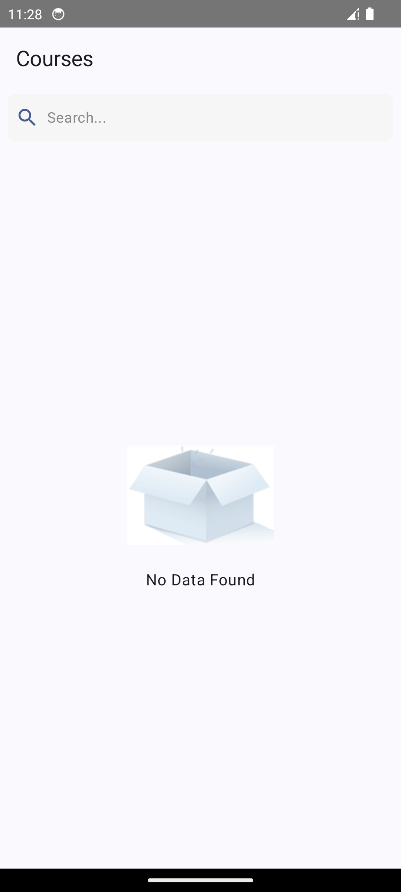
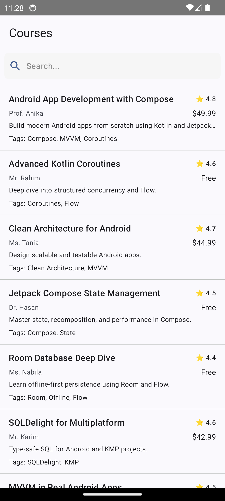

<html><head></head><body><h1>📝 Course Hero App</h1>
A modern Android app built with <strong>Kotlin</strong>, demonstrating <strong>MVVM architecture</strong>, <strong>offline-first caching</strong>, <strong>Jetpack Compose UI</strong>, and <strong>Ktor networking</strong>.

This project showcases fetching, caching, filtering, and updating course data from a mock <strong>Beeceptor API endpoint</strong>.

<h2>🧭 Table of Contents</h2><ul><li>
<a href="https://chatgpt.com/c/6961dda8-519c-8324-8d3f-3522f5f98dfe#-features">✨ Features</a>
</li><li>
<a href="https://chatgpt.com/c/6961dda8-519c-8324-8d3f-3522f5f98dfe#-app-links">🔗 App Links</a>
</li><li>
<a href="https://chatgpt.com/c/6961dda8-519c-8324-8d3f-3522f5f98dfe#-user-manual--known-issues">📖 User Manual &amp; Known Issues</a>
<ul><li>
<a href="https://chatgpt.com/c/6961dda8-519c-8324-8d3f-3522f5f98dfe#how-to-use">How to Use</a>
</li><li>
<a href="https://chatgpt.com/c/6961dda8-519c-8324-8d3f-3522f5f98dfe#current-limitations">Current Limitations</a>
</li></ul></li><li>
<a href="https://chatgpt.com/c/6961dda8-519c-8324-8d3f-3522f5f98dfe#-technical-details">💻 Technical Details</a>
<ul><li>
<a href="https://chatgpt.com/c/6961dda8-519c-8324-8d3f-3522f5f98dfe#architecture--tech-stack">Architecture &amp; Tech Stack</a>
</li></ul></li><li>
<a href="https://chatgpt.com/c/6961dda8-519c-8324-8d3f-3522f5f98dfe#-screenshots">📸 Screenshots</a>
</li></ul>
<h2>✨ Features</h2><ul><li>
<strong>Course List:</strong> Displays a scrollable list of courses fetched from a mock API.
</li><li>
<strong>Course Detail:</strong> View full course details including instructor info, rating, price, and tags.
</li><li>
<strong>Offline First:</strong> Data cached locally using <strong>Room</strong>; app works offline and syncs when network is available.
</li><li>
<strong>Search &amp; Filter:</strong> Search courses by title or tags using database-level filtering.
</li><li>
<strong>Mark as Enrolled:</strong> Toggle a course as enrolled; reflects immediately in the list.
</li><li>
<strong>Navigation:</strong> Smooth navigation between <strong>Course List</strong> and <strong>Course Detail</strong> using Jetpack Navigation Compose.
</li><li>
<strong>Coroutines &amp; Flow:</strong> All network/database operations use Kotlin Coroutines and Flow for non-blocking, reactive UI updates.
</li><li>
<strong>Dependency Injection:</strong> <strong>Hilt</strong> manages repositories, ViewModels, and network/database dependencies.
</li></ul>

A modern Android app built with **Kotlin**, demonstrating **MVVM architecture**, **offline-first caching**, **Jetpack Compose UI**, and **Ktor networking**.

This project showcases fetching, caching, filtering, and updating course data from a mock **Beeceptor API endpoint**.

---

## ✨ Features

* **Course List:** Displays a scrollable list of courses fetched from a mock API.
* **Course Detail:** View full course details including instructor info, rating, price, and tags.
* **Offline First:** Data cached locally using **Room**; app works offline and syncs when network is available.
* **Search & Filter:** Search courses by title or tags using database-level filtering.
* **Mark as Enrolled:** Toggle a course as enrolled; reflects immediately in the list.
* **Navigation:** Smooth navigation between **Course List** and **Course Detail** using Jetpack Navigation Compose.
* **Coroutines & Flow:** All network/database operations use Kotlin Coroutines and Flow for non-blocking, reactive UI updates.
* **Dependency Injection:** **Hilt** manages repositories, ViewModels, and network/database dependencies.

---

## 🔗 App Links

| Description           | Link                                                               |
| :-------------------- | :----------------------------------------------------------------- |
| **Video Preview**     | https://www.youtube.com/watch?v=sOXpkhi6FCE|
| **APK Download**      |   https://drive.google.com/file/d/1EkjBpYQ1RdOon_j6jhY6EJIFJkIoMTeo/view?usp=sharing|
| **GitHub Repository** | https://github.com/khalekuzzamancse/Course-Managment-System   |

---

## 📖 User Manual & Known Issues

### How to Use

* **View Courses:** Open the app to see the list of courses.
* **Search Courses:** Use the search bar to filter courses by title or tags.
* **Course Detail:** Tap a course to see its details.
* **Mark as Enrolled:** Click the "Mark as Enrolled" button to update the course status. Status changes reflect immediately in the list.

---

## 💻 Technical Details

### Architecture & Tech Stack

| Component                | Technology/Concept           | Usage                                                                |
| :----------------------- | :--------------------------- | :------------------------------------------------------------------- |
| **Networking**           | **Ktor Client**              | Fetch courses from Beeceptor mock API.                               |
| **Local Persistence**    | **Room**                     | Offline caching and database-level filtering.                        |
| **Concurrency**          | **Kotlin Coroutines & Flow** | Non-blocking network/database operations with reactive UI updates.   |
| **Dependency Injection** | **Hilt**                     | Manage ViewModel, Repository, and network/database dependencies.     |
| **UI**                   | **Jetpack Compose**          | Entire app UI implemented using Compose, including state management. |
| **Navigation**           | **Navigation Compose**       | Navigate between Course List and Detail screens.                     |
| **Architecture**         | **MVVM**                     | Clear separation of concerns for maintainability and testability.    |

---

## 📸 Screenshots

### **Course List Screen**

### **Search / Filter**

### **Course Detail Screen**

### **Mark as Enrolled**

---

### Beeceptor API
**Endpoint URL:** `[https://programmingherotask.free.beeceptor.com/courses`

